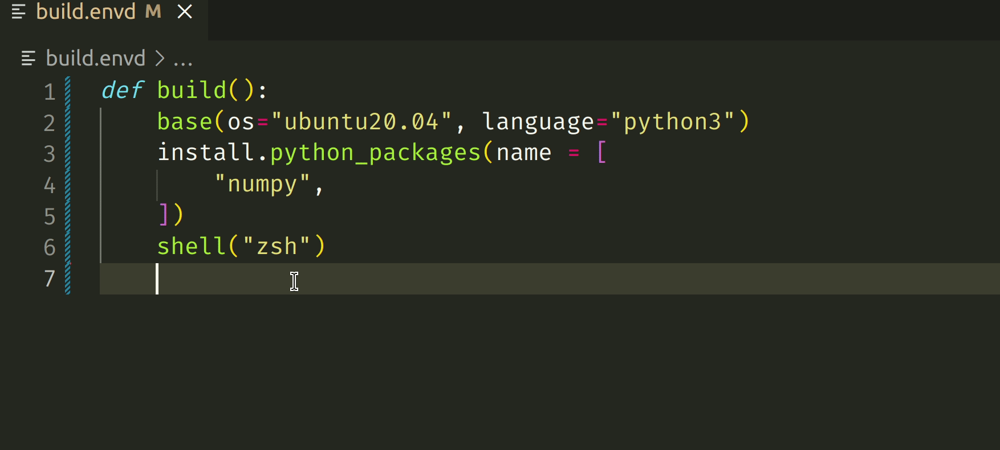

# vscode-envd README

This is the README for your extension "vscode-envd". After writing up a brief description, we recommend including the following sections.

## Features

## Acknowledgement

- Thank [vsode-tilt](https://github.com/tilt-dev/vscode-tilt) for its vscode extension.
