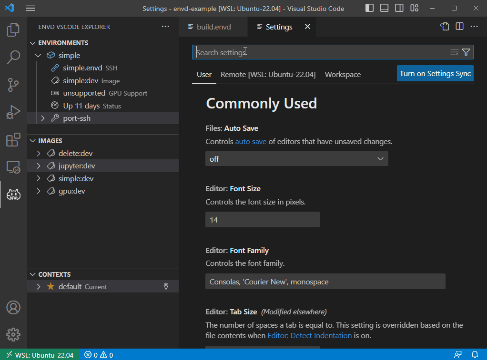

## Envd for Visual Studio Code    

The `envd extension` helps to build, manage or destroy environments of `envd`. It provides user friendly interface for most common environments, images and contexts operations.

## Installation

By default, `envd extension` use system `pip3` to manage `envd` executable.

You don't need to install `envd` manually. We would arrange all for you.

To use another `pip` manager rather than the system default, you could choose it in the options.

If you don't like any package manager, you can also point to an absolute `envd` executable path. In this case, the version check and update prompt will be disabled.

## Overview of the extension features

### Editing envd files

You can get [IntelliSense](https://code.visualstudio.com/docs/editor/intellisense) when editing your `build.envd` files, with completions and syntax help for common functions.

### Build envd environment

We support `envd up` and `envd build` commands for each `def build_xxx()` entry. These commands will be provided as [CodeLens](https://code.visualstudio.com/blogs/2017/02/12/code-lens-roundup). 

Though any function could be used as an entry, only functions containing `build` will be recognized as an entry. As `build()` is `envd` default entry, we hope everyone could have a good practice.

| **✔️** Good entries | ⚠️ Bad entries   | ❌ Unrecognized |
| ------------------ | --------------- | -------------- |
| `build()`          | `build010()`    | `BUILD()`      |
| `jupyter_build()`  | `nvidiabuild()` | `Build()`      |
| `build_GPU()`      | `buildings()`   | `jupyter()`    |

### Environment Explorer

The `envd extension` contributes an `envd` Explorer view to VS Code. The Explorer lets you examine and manage `envd` assets: environments, images and contexts. 

To remove any environment, image or context, you could choose `Remove` or `Destroy` from right-click menu.

### Attach to environment

This is a special feature for the `VSCode` platform, the extension will provide similar usage to `VSCode Remote Development` extension. If you are familiar with development at `Remote-SSH` or `wsl`, things will be easy.

To attach to an `envd` environment at a `VSCode` Terminal, you could click `Attach to terminal` from `Environment Explorer` of every environment item, or right-click menu.

To attach to an `envd` environment at a new `VSCode` Window, you could click `Attach to VSCode` from `Environment Explorer` of every environment item, or right-click menu.

Some environments will provide endpoint like `jupyter`, you could attach to them by click either.

### New version notification and installation

When a new version of `envd` is available, `envd extension` will show a notification, and instruct you to install it in need. This happens every time the extension is activated. If you need to fix `envd` version, turn off the `Check Version` checkbox at options.

You can also switch the version of `envd` at any time you want if the `pip` package manager is enabled.

## Acknowledgement

- Thank [vsode-tilt](https://github.com/tilt-dev/vscode-tilt) for its vscode extension.
